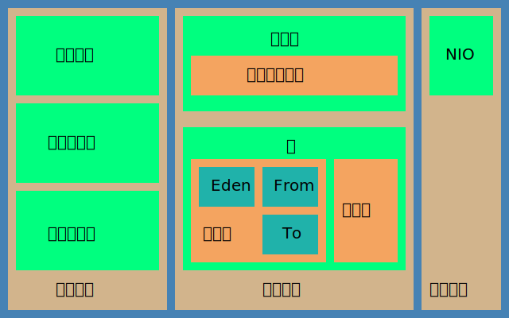

# Java虚拟机

## 编译

> 命令: javac

## 类加载

- 类加载器
  - 启动类加载器
    - Bootstrap ClassLoader
    - <JAVA_HOME>/lib
  - 扩展类加载器
    - Extension ClassLoader
    - <JAVA_HOME>/lib/ext
  - 应用类加载器
    - Application ClassLoader
    - <CLASS_PATH>
  - 自定义类加载器
- 双亲委派
  - 向上委托加载，形成优先级机制，保护了最上层核心代码
  - 源代码: java.lang.ClassLoader#loadClass(java.lang.String, boolean)

## 内存模型

> 方法区 -> 永久代 -> 元数据区

## GC

- GC
  - 原理
    - 引用类型：强 软 弱 虚
    - 引用算法
      - 引用计数法
      - 可达性分析
  - 算法
    - 复制法copying
    - 标记清除 mark-sweep
    - 标记整理 mark-compact
    - 分代收集
  - 收集器
    - 年轻代
      - Serial
      - ParNew
      - Pallel Canvenge
    - 老年代
      - Serial Old
      - Pallel Old
      - CMS
    - G1
- JVM收集器参数

## 内存参数

- -Xms 堆初始值
- -Xmx 堆最大值 与 -Xms通常设置为相等
- -Xmn 年轻代的大小 通常堆的一半 相同的NewSize与MaxNewSize
  - -XX:NewSize 年轻代初始值
  - -XX:MaxNewSize 年轻代最大值
- -Xss 每个线程的栈大小 32位默认320K 64位默认1M
- -XX:PermSize=128m 永久代最小值
- -XX:MaxPermSize=128m 永久代最大值
- -XX:+PrintGCDetails 打印每次GC的详情
- -XX:MetaspaceSize=128m 元数据区初始值
- -XX:MaxMetaspaceSize=320m 元数据区最大值

## 调优
## 内存泄露与溢出
