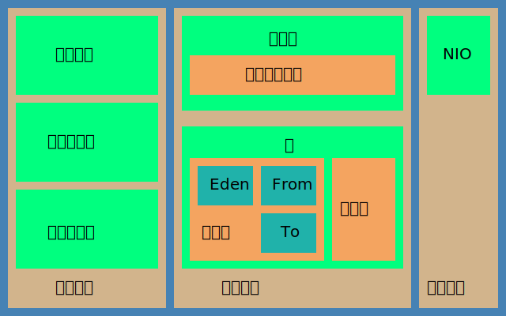

# Java虚拟机

## 编译

> 命令: javac

## 类加载

- 类加载器
  - 启动类加载器
    - Bootstrap ClassLoader
    - <JAVA_HOME>/lib
  - 扩展类加载器
    - Extension ClassLoader
    - <JAVA_HOME>/lib/ext
  - 应用类加载器
    - Application ClassLoader
    - <CLASS_PATH>
  - 自定义类加载器
- 双亲委派
  - 向上委托加载，形成优先级机制，保护了最上层核心代码
  - 源代码: java.lang.ClassLoader#loadClass(java.lang.String, boolean)

## 内存模型

> 方法区 -> 永久代 -> 元数据区

## GC

- GC
  - 原理
    - 引用类型：强 软 弱 虚
    - 引用算法
      - 引用计数法
      - 可达性分析
  - 算法
    - 复制法copying
    - 标记清除 mark-sweep
    - 标记整理 mark-compact
    - 分代收集
  - 收集器
    - 年轻代
      - Serial
      - ParNew
      - Pallel Canvenge
    - 老年代
      - Serial Old
      - Pallel Old
      - CMS
    - G1
- JVM收集器参数

## 内存参数
## 调优
## 内存泄露与溢出
